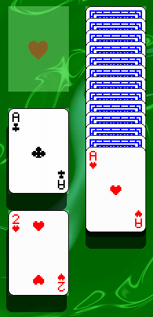

## Solitaire-Klondike

Solitaire Klondike game made in godot engine

### Preview

#### Card

#### Stock and Waste

#### Tableau

#### Foundation

#### Undo

#### Tips

### Reference

- Shader background: [Shader 类小丑牌背景效果](https://post.tuclink.com/zh/post/shader/shader-2)

- Shader card: [2D-perspective](https://godotshaders.com/shader/2d-perspective/)

- Poker Cards assets: [poker-pack](https://screamingbrainstudios.itch.io/poker-pack)

- Audio Effect "game_success": [success 1](https://pixabay.com/sound-effects/success-1-6297/)

- Audio Effect "game_start": [Game Start](https://pixabay.com/sound-effects/game-start-6104/)

- Audio Effect(ohters): [BFSX](https://www.bfxr.net/)
